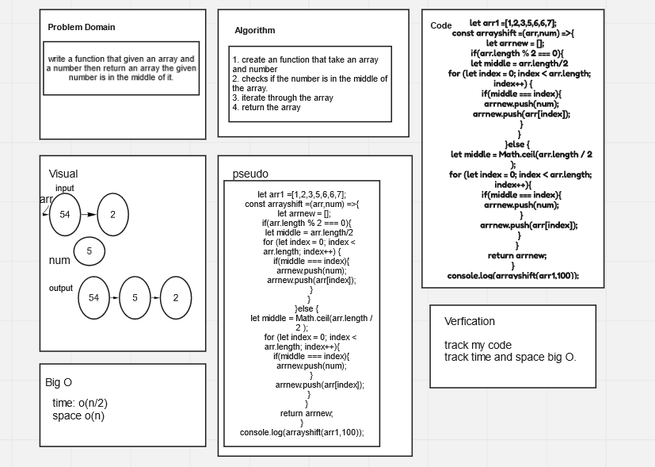

# Insert to Middle of an Array

Write a function that given an array and a number then return an array the given number is in the middle of it.

## Whiteboard Process

## Approach & Efficiency

The Big O for this approach is O(n/2) because it have a for loop 

